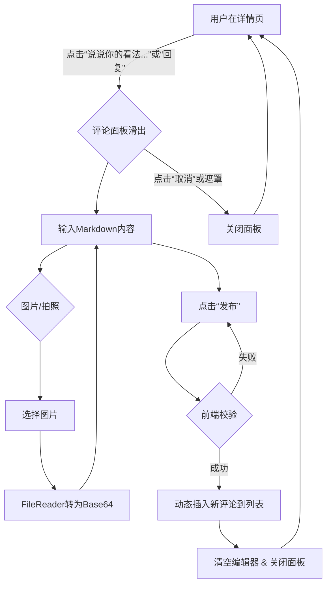
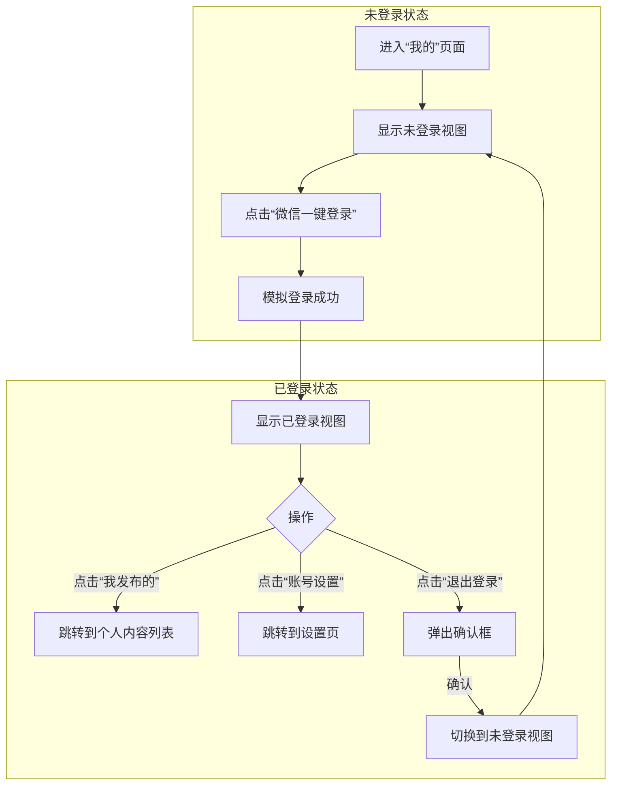

# CodeVibe 社区平台产品需求文档 (PRD) v2.0

## 1\. 项目概述

### 1.1. 项目简介

VibeCoding 是一个现代化的技术问答与分享社区平台，旨在为开发者提供一个高质量、高效率、沉浸式的技术交流和知识分享环境。产品形态主要为微信小程序，核心功能是允许用户发布、浏览和互动（评论、点赞、收藏、分享）图文及视频内容。

### 1.2. 核心目标

  * **极致的用户体验**: 通过卡片式设计、平滑的动效和沉浸式浏览，提供移动端优先的极致体验。
  * **高质量内容**: 鼓励深度技术内容的创作与分享，支持 Markdown 格式和富文本。
  * **高效的互动**: 提供便捷、强大的评论与回复系统，促进社区成员间的有效沟通。

### 1.3. 设计语言

  * **整体风格**: 遵循 Google 的卡片式设计风格（Card-based Design），界面简洁、层级清晰。
  * **主色调**: 以品牌蓝 (`#4285F4`) 和白色为主色调，营造专业、清爽的技术社区氛围。
  * **核心原型**: 所有页面的设计均基于一个 `420x850px` 的手机模型 (`.mobile-shell`) 进行，确保移动端体验的一致性。

## 2\. 全局功能与组件

### 2.1. 底部菜单 (Bottom Navigation Bar)

底部菜单是应用的核心导航，固定在所有主页面的底部。

  * **来源**: `vibecoding_club.md`, `list.html`, `my.html`, `favorites.html`
  * **布局**: 包含五个导航项，均匀分布：
    1.  **社区首页**: 默认选中页面。
    2.  **社区精华**: 精选内容列表。
    3.  **发布 (FAB)**: 一个尺寸更大 (`w-16 h-16`) 的圆形蓝色浮动操作按钮 (Floating Action Button)，向上偏移并悬浮于导航栏之上，作为视觉焦点。内部为白色 `+` 号图标。
    4.  **收藏**: 用户收藏的内容列表。
    5.  **我的**: 用户个人中心。
  * **状态**: 当前激活的导航项，其图标和文字会显示为品牌蓝色，其他项为灰色。

## 3\. 功能模块详解

### 3.1. 社区首页 (列表页)

  * **原型文件**: `list.html`
  * **原型提示词**: `列表页.md`

#### 3.1.1. 核心目标

提供一个沉浸式的信息流，让用户可以高效地浏览社区内的最新或最热内容。

#### 3.1.2. 页面布局与交互

1.  **顶部状态栏**: 固定在顶部，左侧对齐显示社区名称 "VibeCoding"。
2.  **内容滚动区**:
      * 采用 **CSS Scroll Snap** 技术，实现“一划一张”的滚动吸附效果，用户每次滑动都会精确地将一张卡片置于视图中心。
      * 卡片最大高度不超过视窗的 `75%` (`75vh`)，确保用户能感知到下一张卡片的存在。
3.  **底部菜单**: “首页”图标高亮。

#### 3.1.3. 内容卡片 (Card) 设计

卡片是信息流的核心载体，采用动态渲染，其结构如下：

1.  **用户信息**: 顶部显示发布者的圆形头像和昵称。
2.  **标题**: 加粗、醒目。
3.  **内容区**:
      * **优先级**: 视频 \> 图片 \> 纯文本。
      * **视频**: 直接在卡片内嵌入 `<video>` 播放器，可直接播放。
      * **图片**: 单图直接展示；多图以内置的水平画廊形式展示，可左右滑动。
      * **纯文本**: 若内容过长，则内容区内部可独立滚动。
4.  **标签区**: 在内容下方，以圆角胶囊样式展示多个技术标签。
5.  **互动数据**: 用图标和数字清晰展示点赞数和评论数。
6.  **操作按钮**: 提供“收藏”和“分享”的图标按钮。
7.  **评论预览区**:
      * 在卡片最底部，展示点赞最多的 **2-3 条**评论预览。
      * 每条评论包含“**作者昵称:**”和评论内容。
      * 提供“查看全部 N 条评论...”的链接，点击后跳转至**内容详情页**。

### 3.2. 内容详情页

  * **原型文件**: `detail.html`
  * **原型提示词**: `详情页.md`

#### 3.2.1. 核心目标

完整展示帖子内容，并提供一个强大的、全功能的评论与互动系统。

#### 3.2.2. 页面布局

1.  **顶部导航栏**: 左侧为“返回”图标和文字，用于返回列表页。
2.  **内容滚动区**: 展示帖子完整内容和所有评论。
3.  **底部固定操作栏**:
      * 左侧是一个浅灰色的输入框提示“说说你的看法...”，作为**打开评论面板的主要触发器**。
      * 右侧是“点赞”、“收藏”图标按钮。

#### 3.2.3. 内容展示

  * **Markdown 渲染**: 完整支持 Markdown 格式，包括标题、段落、引用、列表、图片等。
  * **代码高亮**: 代码块 (`<pre><code>`) 使用 `highlight.js` 库和 `atom-one-dark` 主题进行语法高亮。

#### 3.2.4. 评论/回复系统 (核心交互)

这是一个从底部滑出的多功能面板。

  * **触发**: 点击底部操作栏的输入框提示或任一评论下的“回复”按钮。
  * **动画与布局**:
      * 面板从底部平滑滑出，初始高度 `60vh`，同时页面出现半透明黑色遮罩。
      * 点击遮罩可关闭面板。
      * 面板头部有关闭、发布按钮和一个**全屏切换**图标。点击全屏后，面板高度平滑过渡到 `100dvh`。
  * **编辑器**:
      * 面板内集成 **Toast UI Editor** (所见即所得模式)。
      * 工具栏精简为常用项，并包含一个**自定义的图片上传按钮组**。
      * **图片上传**:
        1.  提供“拍照”和“从图库选择”两个功能（使用内联 SVG 图标）。
        2.  通过 `FileReader` API 将用户选择的图片（支持多选）转为 **Base64** 格式，直接插入编辑器实现本地预览。
  * **评论发布流程**:
    1.  用户在编辑器中输入内容。
    2.  点击“发布”按钮。
    3.  JS 获取编辑器内容，动态在页面的评论列表顶部创建并插入新评论。
    4.  清空编辑器，关闭面板，并 `alert` 提示发布成功。
  * **评论删除**: 用户自己的评论旁有“删除”按钮，点击后经 `confirm` 确认，该评论会播放淡出动画并从 DOM 中移除。

#### 3.2.5. 评论流程图



### 3.3. 发布内容

  * **原型文件**: `publish.html`
  * **原型提示词**: `发布.md`

#### 3.3.1. 核心目标

提供一个沉浸式、无干扰的内容创作环境，支持富文本、多格式导入和标签系统。

#### 3.3.2. 交互流程

1.  **入口**: 用户点击任意主页面底部导航栏中央的蓝色 `+` FAB。
2.  **动画**: 一个全屏的白色面板（顶部带圆角）从屏幕底部平滑滑入，覆盖整个页面，后方出现半透明遮罩。
3.  **关闭**: 点击面板左上角的“取消”按钮，面板滑下收回，并**清空所有已输入内容**。

#### 3.3.3. 发布面板UI与功能

1.  **顶部应用栏**:
      * **左侧**: “取消”文字按钮。
      * **中间**: “发布内容”标题。
      * **右侧**: “发布”填充按钮（蓝色背景）。
2.  **输入区**:
      * **标题**: 顶部的大字体输入框。
      * **标签**: 允许用户输入文字后按回车添加标签（Chip样式），最多5个，每个标签都可单独移除。
3.  **编辑器**:
      * 主体区域集成 **Vditor** Markdown 编辑器，开启打字机模式。
      * **工具栏**:
          * 包含标题、加粗、代码、列表等常用功能。
          * 包含标准的**图片上传**按钮，逻辑与评论面板一致（多选、Base64预览）。
          * 包含一个自定义的\*\*“导入文件”\*\*按钮（SVG图标），可导入 `.md` 或 `.pdf` 文件（原型中为模拟操作）。
4.  **发布逻辑**:
      * 点击“发布”按钮，校验标题和内容不为空。
      * 校验通过后，在控制台打印出包含标题、标签数组、Markdown 内容的对象，模拟 API 调用。
      * `alert` 提示发布成功，并自动调用关闭面板的逻辑。

#### 3.3.4. 发布流程图

```mermaid
graph TD
    A[用户在任意主页] -->|点击 '+' FAB| B(发布面板从底部滑入);
    B --> C{输入标题、标签、内容};
    C --> D(使用Vditor编辑器);
    D --> E{上传图片/导入文件};
    E --> D;
    C --> F[点击“发布”];
    F --> G{内容校验};
    G -- 通过 --> H[Console.log(发布数据)];
    H --> I[Alert('发布成功')];
    I --> J(清空并关闭面板);
    J --> A;
    G -- 不通过 --> F;
    B -->|点击“取消”| J;
```

### 3.4. 收藏页

  * **原型文件**: `favorites.html`

#### 3.4.1. 核心目标

为用户提供一个集中管理和回顾自己已收藏内容的页面，并支持快速搜索和筛选。

#### 3.4.2. 页面布局与功能

1.  **顶部状态栏**: 标题为“我的收藏”。
2.  **搜索框**: 页面顶部提供一个“搜索我的收藏”的圆角输入框。
3.  **标签筛选栏**:
      * 位于搜索框下方，是一个**可水平滚动**的区域。
      * 动态生成用户所有收藏内容中包含的标签，并显示该标签下的收藏数量，如 `React (5)`。
      * 提供一个“全部”标签作为默认选项。
      * 点击标签可筛选下方的内容列表（原型阶段仅打印日志）。
4.  **内容列表**:
      * 与**社区首页**完全一致，采用卡片式、滚动吸附的设计。
      * 卡片内容为用户收藏的帖子。
      * 卡片上的“收藏”按钮应为**已激活**状态（例如，填充色图标）。

### 3.5. 我的

  * **原型文件**: `my.html`
  * **原型提示词**: `我的.md`

#### 3.5.1. 核心目标

提供用户个人资料管理、内容管理入口，并处理用户的登录、注册与退出状态。

#### 3.5.2. 核心逻辑：双视图切换

页面通过 JS 管理 `isLoggedIn` 状态，动态显示“已登录”或“未登录”两种视图。

#### 3.5.3. 未登录视图 (`#logged-out-view`)

  * **布局**: 垂直居中的卡片。
  * **内容**:
      * 灰色圆形头像占位符。
      * 引导文案：“登录 VibeCoding, 分享你的代码人生”。
      * 一个醒目的蓝色按钮：“微信一键登录/注册”。
  * **交互**: 点击登录按钮，`alert` 模拟登录成功，然后切换到**已登录视图**。

#### 3.5.4. 已登录视图 (`#logged-in-view`)

  * **布局**: 由多个卡片组成。
  * **个人资料卡片**:
      * 顶部卡片，包含用户头像、昵称、手机号。
  * **操作列表卡片**:
      * 包含“我发布的”、“账号设置”等列表项。
      * 点击“我发布的”将跳转到**列表页**，并传入参数以只显示该用户发布的内容。
  * **退出登录按钮**:
      * 页面底部独立的、视觉突出的按钮（白色背景，红色文字）。
      * 点击后 `confirm` 确认，然后切换到**未登录视图**。

#### 3.5.5. 登录/退出流程图



## 4\. 技术栈需求

根据 `vibecoding_club.md` 规定，技术栈如下：

  * **后端**: Python 3.13.3, FastAPI, SQLAlchemy, MySql, JWT, Pydantic
  * **前端 (Web/H5)**: Vue.js 3, Vue Router, Axios, Tailwind CSS
  * **微信小程序**: 原生小程序开发
  * **原型**: 纯 HTML, Tailwind CSS (CDN), 原生 JavaScript

-----

**文档完结**

这份 v2.0 需求文档整合了所有已知信息，为 VibeCoding 社区的开发提供了清晰、全面、可执行的蓝图。
